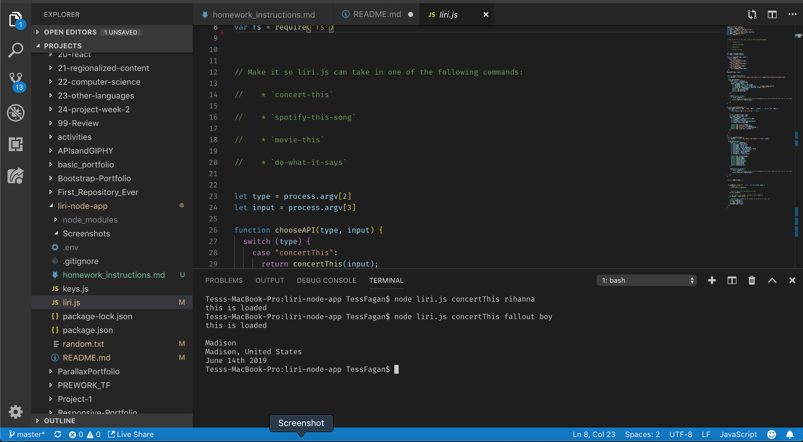
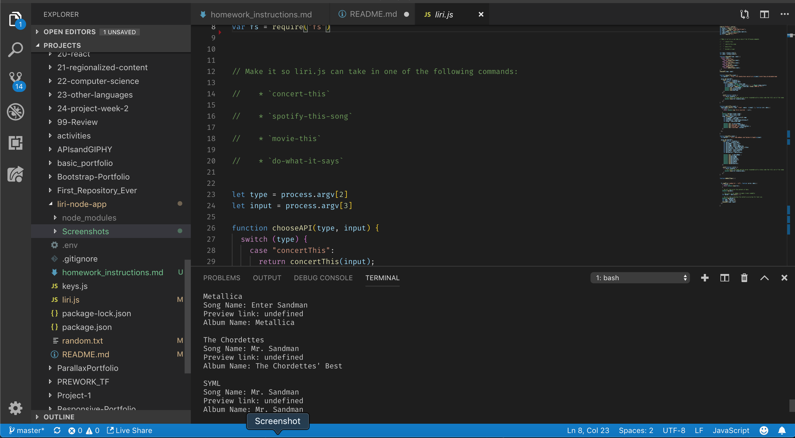
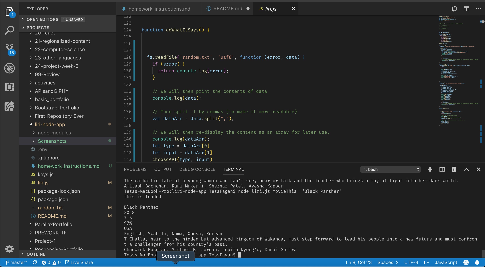
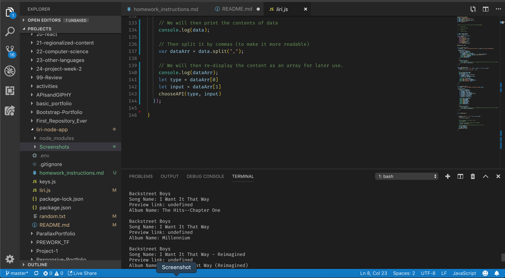

# liri-node-app

**What the project does:**
LIRI is a command line node app that takes in parameters and gives you back data.
The parameters are 4 different functions that can be used to call 3 APIs, or read data from a text file

**Why the project is useful:**
This project was a great learning experience if you are interested in learning about APIs and functions. It is also handy if you are working from the command line a lot, and dont feel like switching tabs to search a movie or song or band's specific information.

**How users can get started with the project:**
Download the git repository and use the different functionality by running it using node from the command line. The syntax is as follows:
"node", "filename" "function you want to use" "thing you are searching"

**Where users can get help with your project:**
This app is not going to be supported in the future, since there are other more robust and user friendly ways to find a song, or find out information about a movie, etc.

**Who maintains and contributes to the project:**
Tess Fagan created and contributed to this project. This project will not be maintained going forward.

**Screenshots**

